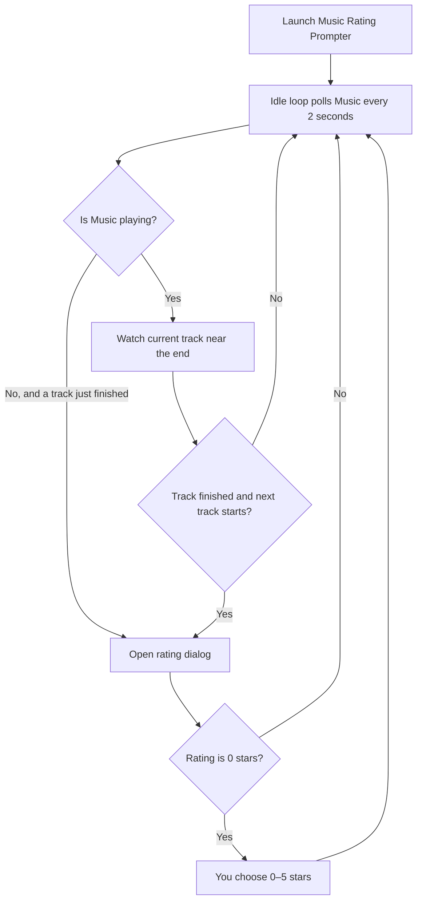

# Music Rating Prompter

Prompt yourself to rate Apple Music songs when they finish playing.

When a track ends with **0 stars**, you choose a rating from 0–5 stars. Tracks that already have a rating are skipped.

## Table of Contents

- [Prerequisites](#prerequisites)
- [Quick start](#quick-start)
- [How it works](#how-it-works)
- [Build from source](#build-from-source)
  - [Option 1: Script Editor](#option-1-script-editor)
  - [Option 2: Command line](#option-2-command-line)
- [First launch](#first-launch)
- [Usage](#usage)
- [Configuration](#configuration)
- [Troubleshooting](#troubleshooting)
- [License](#license)

## Prerequisites

Before you start, make sure you have:

| Requirement | Details |
|-------------|---------|
| **macOS** | Required — this tool does not run on other platforms |
| **Apple Music** | The Music app on your Mac ([Apple Music](https://www.apple.com/apple-music/)) |
| **Automation permission** | macOS must allow this app to control **Music** |

You also need either a download from [GitHub Releases](https://github.com/gamebits/music-rating-prompter/releases), or the source file `MusicRatingPrompter.applescript` if you build it yourself.

## Quick start

Follow these steps to install the pre-built app:

1. Open the latest [GitHub Release](https://github.com/gamebits/music-rating-prompter/releases).
2. Download the Universal application zip and unzip it.
3. Open **Music Rating Prompter.app**.
4. When macOS asks for Automation access to **Music**, click **Allow**.

The app stays open in the background until you quit it from the Dock or menu bar.

## How it works



## Build from source

Use this path when you want to compile from `MusicRatingPrompter.applescript` yourself.

Because the script uses an `on idle` handler, you must compile it as a **stay-open application**. Without that setting, the app launches and quits immediately.

### Option 1: Script Editor

1. Open `MusicRatingPrompter.applescript` in **Script Editor** (included with macOS).
2. Choose **File → Export** (or **File → Save as Application** on older macOS versions).
3. Set **File Format** to **Application**.
4. Enable **Stay open after run handler** — this step is required.
5. Save as `Music Rating Prompter.app`.

To ship a Universal binary, use the architecture options in Script Editor’s export dialog, then attach the `.app` (or a zip of it) to a [GitHub Release](https://github.com/gamebits/music-rating-prompter/releases).

### Option 2: Command line

From the repository root on a Mac:

```bash
# Make the build script executable (first time only)
chmod +x build.sh

# Compile a stay-open Music Rating Prompter.app in this folder
./build.sh
```

What this does: `build.sh` runs `osacompile -s` so the app stays open and can poll Music on an idle timer.

The command-line build matches the architecture of the Mac you run it on. Use Script Editor if you need a Universal binary for Releases.

## First launch

The first time you run the app, macOS may show:

> **"Music Rating Prompter" wants access to control "Music."**

Click **Allow**. Without that permission, the app cannot read playback or set ratings.

You can change this later in **System Settings → Privacy & Security → Automation**.

You may also see a short notification: **Monitoring Apple Music for unrated tracks.** That confirms the app is running. Look for the app icon in the Dock as well.

## Usage

1. Launch `Music Rating Prompter.app` before or during playback.
2. Play music in Apple Music as usual.
3. When an unrated song finishes, choose a rating in the **Rate Finished Song** dialog — or dismiss it to skip.
4. Quit the app when you no longer want prompts. It does not exit on its own.

## Configuration

Edit the properties at the top of `MusicRatingPrompter.applescript`, then re-export or rebuild the app.

| Property | Default | `1` | `0` |
|----------|---------|-----|-----|
| `playPromptBeep` | `0` | Play the macOS alert sound when the dialog opens | Silent dialog |
| `bringPromptToFront` | `1` | Bring the rating dialog to the foreground | Leave focus on your current app |

Example:

```applescript
-- Silent dialog (default). Set to 1 if you want the system alert beep.
property playPromptBeep : 0

-- Bring the prompt forward (default). Set to 0 if focus stealing feels disruptive.
property bringPromptToFront : 1
```

## Troubleshooting

| Problem | What to try |
|---------|-------------|
| The app does nothing after launch | Re-export with **Stay open after run handler** enabled. Confirm the Dock icon stays visible and look for the startup notification. |
| No rating prompt appears | Rate only tracks with **0 stars**. Let the song reach its final few seconds or finish. Grant **Automation** for Music in **System Settings → Privacy & Security → Automation**. |
| Dialog stays in the background | Set `bringPromptToFront` to `1`, then rebuild. If you prefer less interruption, leave it at `0` and check the Dock for the waiting dialog. |

**Testing tip:** Do not use **Run** in Script Editor to test idle behavior. Export as a stay-open application and launch it from Finder.

For script errors, open **Console.app**, filter for `Music Rating Prompter`, and review the log messages.

## License

This project is licensed under the [GNU General Public License v2.0](LICENSE).
